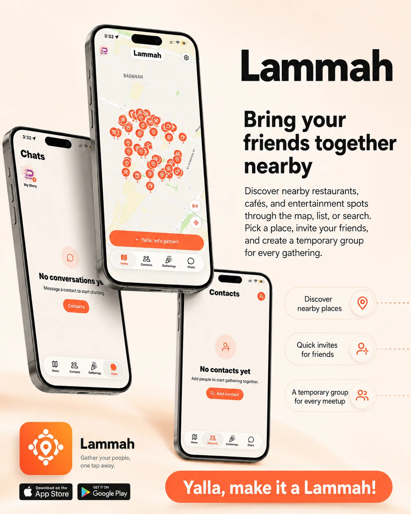
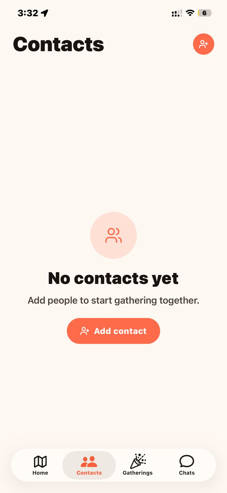
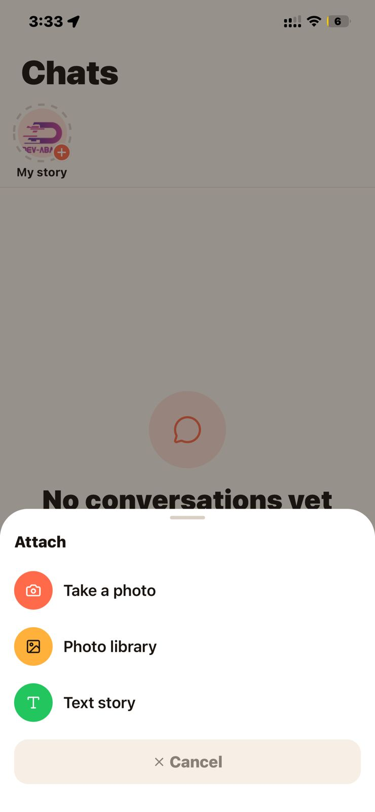
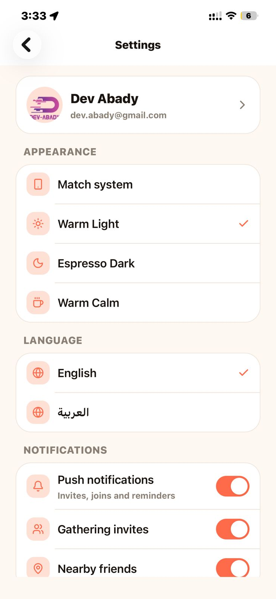
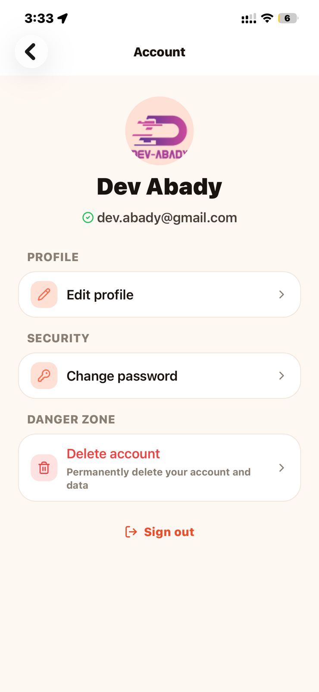
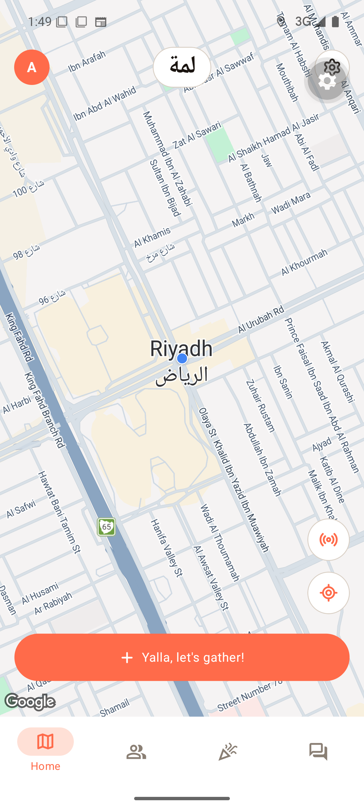
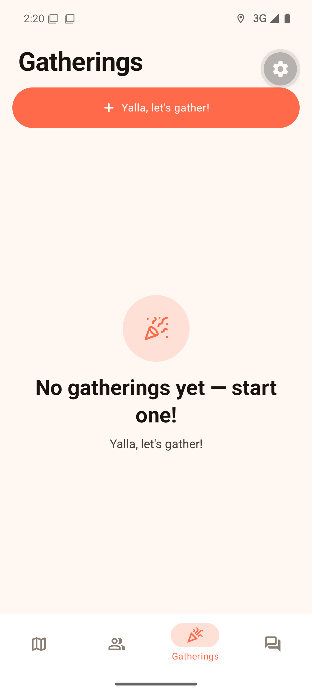
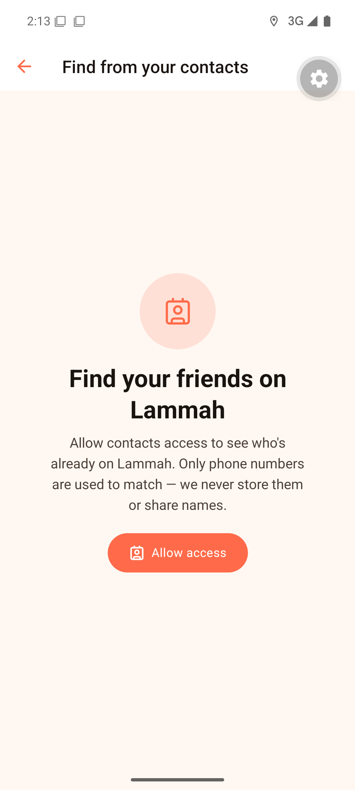
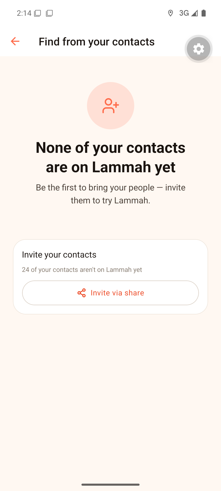
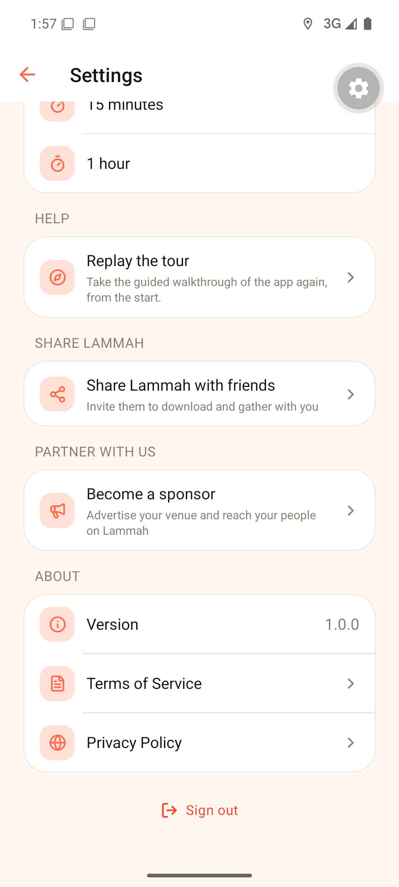

<div align="center">

# لمة · Lammah

**A social map app that turns "we should hang out sometime" into "we're at the café, come."**

*Built with React Native (Expo) · Next.js · PostgreSQL/PostGIS · Redis · Socket.IO*

<br/>



</div>

---

> **ملاحظة بالعربي:** «لمة» يعني الجمعة والاجتماع العفوي بين الربع. التطبيق يحل مشكلة نعرفها كلنا: التخطيط للقاء الأصدقاء صار أصعب من اللقاء نفسه. بضغطة وحدة ترسل «يلا نلتم في المكان الفلاني» لكل ربعك، ومن يقدر يجي، يجي. هذا المستودع عرض تفصيلي للمشروع بدون كود المصدر، لأنه مشروع تجاري قيد التطوير.

---

## What is this?

Lammah (Arabic for *"a gathering"*) is a GPS-first social app in the spirit of Zenly, built for how my friends and I actually meet up: spontaneously. Nobody sends calendar invites to go get coffee. Someone just says *"يلا نلتم"*, meaning "let's gather", and whoever's free shows up.

The core loop is deliberately short:

1. Tap one button (in the app, or straight from a **home-screen widget**).
2. GPS lists nearby cafés, restaurants and malls. **Sponsored venues rank first**, and that's the business model.
3. Pick a place, pick who to invite (everyone, or a private subset).
4. Friends get a push notification and join with one tap.
5. Everyone sees everyone's live distance to the spot, and a group chat spins up automatically.

**Why no source code?** Lammah is a commercial product currently in closed beta with real testers. This repo is a deep-dive portfolio write-up instead: the feature set, the architecture, and a few engineering problems I'm genuinely proud of solving. If you're reviewing this for hiring purposes and want to go deeper on any part of it, I'm happy to walk through the actual code in a call.

---

## Screenshots

**On iPhone** (captured on a physical device — the app ships on both platforms):

| Contacts | Chats & stories | Settings | Account |
|:---:|:---:|:---:|:---:|
|  |  |  |  |

**On Android** (development build):

| Launch | Live map | Gatherings |
|:---:|:---:|:---:|
|  |  |  |

| Contact sync | Invite via share | Settings |
|:---:|:---:|:---:|
|  |  |  |

*(The small gear overlay in the Android shots is the Expo dev-client menu, not part of the app.)*

---

## Feature surface (all shipped, not a wishlist)

**The gathering itself**
- Create a لمة at any nearby place, schedule it (now / tonight / custom), and it auto-expires.
- Invitees accept, decline, **apologize after accepting** (the host gets a proper "can't make it" push, not a silent drop), or **rejoin** after declining.
- The detail screen shows each person's **live distance in meters** from the spot.
- Host tools: edit the time, remove members, cancel. Everyone's view updates in realtime.
- **Bill splitting**: set a total at creation and it re-splits automatically as more people accept.
- Forward a gathering to your own contacts, and invite friends who *aren't on the app yet* through the native share sheet (their WhatsApp/SMS, so no SMS provider costs).

**Presence & the map**
- Live friend locations over WebSockets, with privacy controls (precise or approximate, sharing duration, off).
- Hand-rolled **grid clustering**, with the rule that sponsored pins are never swallowed by a cluster.
- Custom dark map style, marker selection animations, pan-to-load with skeleton "radar" ghost pins.

**Chat (the part that quietly became a full messenger)**
- Per-gathering group chat + 1:1 DMs.
- **Voice notes** (recorded with expo-audio and streamed as native multipart, details below), images, file attachments.
- WhatsApp-style **reactions**, **read receipts** (✓ / ✓✓ / ✓✓-read), and delivery tracking.
- Automatic system notices like *"X is near the place"* and *"X arrived"*, so the chat wakes up exactly when people start showing up.
- A rejecter or apologizer is cleanly cut off from the group chat and its notifications until they rejoin. Membership is the single source of truth.

**Growth & discovery**
- **Contact sync**: match your phone book against registered users. Only phone digests leave the device, names never do, and nothing is stored server-side.
- 24-hour **stories** with view receipts, friends-only.
- Friend requests with realtime + push notifications.
- **Sponsored venues**: the monetization backbone. Sponsors rank first in every discovery surface, get proximity ad copy, and venues apply through an in-app "become a sponsor" form.

**Platform polish**
- Android **home-screen widget** with category shortcuts (café / restaurant / mall) deep-linking into the gather flow. An iOS WidgetKit twin is in progress.
- Full **Arabic + English** with runtime language switching and complete RTL support.
- Three-theme design system (warm light / espresso dark / calm). Every color in the app is a semantic token, with zero hardcoded hex outside the design system.
- Custom onboarding: an SVG-spotlight guided tour built from scratch (mask holes + spring animations) after third-party libs fell short.
- A cinematic black launch sequence: OLED-black native splash flowing into an animated "ember" choreography (radial SVG glow, spring physics, zoom-through exit).
- Push notifications for invites, joins, messages and friend requests, with channels, deep links, and offline fan-out.

---

## Architecture

Monorepo, two apps, clean architecture on both sides. Dependencies point inward; framework code stays at the edges.

```
Lammah/
├─ Lammah.Client/          Expo SDK 56 · React Native 0.85 · React 19 · TypeScript strict
│  └─ src/
│     ├─ app/              expo-router file routes (thin, no logic)
│     ├─ features/         vertical slices: gatherings, chat, map, contacts, stories…
│     ├─ core/             pure domain + application (no React, no Expo, no I/O)
│     ├─ services/         adapters: api, realtime, location, notifications, storage
│     └─ design-system/    tokens, themes, primitives (Unistyles 3, a C++ theming engine)
│
└─ Lammah.WebApi/          Next.js 16 App Router · Prisma 7 · PostgreSQL + PostGIS
   └─ src/
      ├─ app/api/          route handlers (thin: validate → use-case → Result → response)
      ├─ core/             entities, use-cases, ports. One job per use-case.
      └─ infrastructure/   Prisma repos, Redis, Twilio, Google, Expo push, better-auth
```

**The parts that matter:**

- **Geospatial**: PostGIS with `ST_DWithin` on a GiST index for "what's near me", with a Haversine fallback path. Sponsored-first ordering is enforced in the query itself, so a client can't reorder it away.
- **Realtime**: a standalone Socket.IO server (Node) with a Redis adapter, separate from the request/response API. Presence, live locations, message/receipt/gathering events all fan out through per-user rooms.
- **State**: server state lives in React Query with careful invalidation + optimistic updates; client state in small Zustand slices; MMKV for fast persistence; SecureStore for tokens.
- **Errors**: use-cases return `Result<T, AppError>`, so nothing throws across boundaries. One place maps errors to HTTP, and pino logs are structured with PII redaction.
- **Delivery**: backend + socket server + Postgres + Redis on Railway; the client ships through EAS builds with OTA updates for JS-only changes.

---

## Stack

| Layer | Choices |
|---|---|
| Mobile | Expo SDK 56, React Native 0.85 (New Architecture), React 19, TypeScript strict |
| UI | Unistyles 3 (C++ theming), Reanimated 4 + Moti (spring physics everywhere), Skia, expo-glass |
| Navigation | expo-router (file-based), native tabs & headers |
| Data | TanStack Query 5, Zustand 5, react-hook-form + zod, MMKV, SecureStore |
| Backend | Next.js 16 App Router, Prisma 7, PostgreSQL 16 + PostGIS, Redis (ioredis) |
| Realtime | Socket.IO 4 + Redis adapter (standalone server) |
| Auth | better-auth (email + Google), Twilio Verify wired for phone OTP |
| Infra | Railway (API, socket, DB, Redis), EAS Build + Update, Expo push |
| i18n | i18next, Arabic + English, full RTL |


---

## Status

In closed beta with a live production backend, real testers, and OTA-updatable clients. Actively developed. The commit log this repo *doesn't* show is embarrassingly long.

## Contact

**AbdulHadi (Dev Abady)** · dev.abady@gmail.com

*I'd rather show you the code than describe it. Happy to screen-share any part of the system in an interview.*
